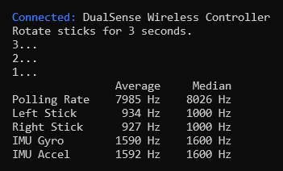
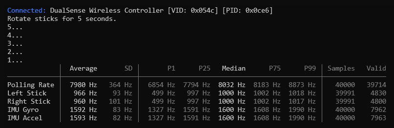

# checkrate

A tool for measuring controller polling rate.



## Download

Windows binaries are provided on the [Releases](https://github.com/ceski-1/checkrate/releases/latest) page. Linux binaries are not provided; see [Compiling](#compiling).

## Usage

Run `checkrate` and follow the instructions.

Optional command line arguments:

| Argument | Description |
| --- | --- |
| `-t <seconds>` or `--time <seconds>` | Number of seconds to measure input |
| `-v` or `--verbose` | Show detailed statistics |

Example:

```
checkrate -v -t 5
```



## Compiling

Requirements:

- [CMake](https://cmake.org) (3.16 or later)
- [libusb](https://github.com/libusb/libusb) (1.0.29 or later)
- [SDL3](https://github.com/libsdl-org/SDL) (3.4.4 or later)

For Windows, [vcpkg](https://github.com/microsoft/vcpkg) is recommended. For Linux, use the libraries provided by your distribution.

Clone the repository:

```
git clone https://github.com/ceski-1/checkrate.git
```

Configure (if using vcpkg):

```
cmake -B build -DCMAKE_TOOLCHAIN_FILE="<path_to_vcpkg>/scripts/buildsystems/vcpkg.cmake"
```

Configure (if not using vcpkg):

```
cmake -B build
```

Build:

```
cmake --build build --config Release
```
