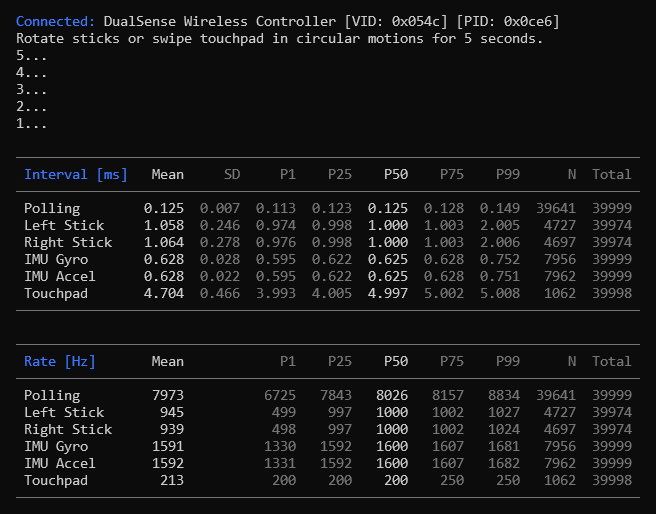

# checkrate

A tool for measuring controller polling rate.


## Download

Windows and Linux binaries are provided on the [Releases](https://github.com/ceski-1/checkrate/releases/latest) page. To build from source, see [Compiling](#compiling).

## Usage

Run `checkrate` and follow the instructions.

Optional command line arguments:

| Argument | Description |
| --- | --- |
| `-o <file>` or `--output <file>` | Write raw data to a CSV file |
| `-t <seconds>` or `--time <seconds>` | Number of seconds to measure input |
| `-v` or `--verbose` | Show detailed statistics |

Example 1 - Measure input for 5 seconds and show detailed statistics:

```
checkrate --verbose --time 5
```



Example 2 - Write raw data to a CSV file:

```
checkrate --output raw_data.csv
```

## CSV File Output

Comma-separated value (CSV) files can be generated using the `--output <file>` command line argument. These files contain raw data captured during measurement. The data is organized in columns, with each row containing data for a given timestamp.

| Column Header | Description |
| --- | --- |
| *ControllerName* | Controller name string (e.g. DualSense Wireless Controller). |
| *LeftStickTime* | Left stick timestamp (nanoseconds). |
| *LeftStickX* | Left stick x-axis value (-32768 to 32767). |
| *LeftStickY* | Left stick y-axis value (-32768 to 32767). |
| *RightStickTime* | Right stick timestamp (nanoseconds). |
| *RightStickX* | Right stick x-axis value (-32768 to 32767). |
| *RightStickY* | Right stick y-axis value (-32768 to 32767). |
| *GyroPacketIndex* | Zero-based index corresponding to the packet that the current gyroscope sample belongs to. Note that Switch controllers send gyroscope samples as triplets (3 samples per packet). |
| *GyroTime* | Gyroscope timestamp (nanoseconds). |
| *GyroPitch* | Gyroscope pitch rate (rad/s). |
| *GyroYaw* | Gyroscope yaw rate (rad/s). |
| *GyroRoll* | Gyroscope roll rate (rad/s). |
| *AccelPacketIndex* | Zero-based index corresponding to the packet that the current accelerometer sample belongs to. Note that Switch controllers send accelerometer samples as triplets (3 samples per packet). |
| *AccelTime* | Accelerometer timestamp (nanoseconds). |
| *AccelX* | Accelerometer x-axis (m/s<sup>2</sup>). |
| *AccelY* | Accelerometer y-axis (m/s<sup>2</sup>). |
| *AccelZ* | Accelerometer z-axis (m/s<sup>2</sup>). |
| *LeftTouchpadTime* | Left touchpad timestamp (nanoseconds). |
| *LeftTouchpadTouch* | Left touchpad touched (0 or 1). |
| *LeftTouchpadX* | Left touchpad x position (0.0 to 1.0, origin is at upper left). |
| *LeftTouchpadY* | Left touchpad y position (0.0 to 1.0, origin is at upper left). |
| *LeftTouchpadPressure* | Left touchpad touch pressure (0.0 to 1.0). |
| *RightTouchpadTime* | Right touchpad timestamp (nanoseconds). |
| *RightTouchpadTouch* | Right touchpad touched (0 or 1). |
| *RightTouchpadX* | Right touchpad x position (0.0 to 1.0, origin is at upper left). |
| *RightTouchpadY* | Right touchpad y position (0.0 to 1.0, origin is at upper left). |
| *RightTouchpadPressure* | Right touchpad touch pressure (0.0 to 1.0). |

## Compiling

Requirements:

- [CMake](https://cmake.org) (3.16 or later)
- [libusb](https://github.com/libusb/libusb) (1.0.29 or later)
- [SDL3](https://github.com/libsdl-org/SDL) (3.4.4 or later)

For Windows, [vcpkg](https://github.com/microsoft/vcpkg) is recommended. For Linux, use the libraries provided by your distribution.

Clone the repository:

```
git clone https://github.com/ceski-1/checkrate.git
```

Configure (if using vcpkg):

```
cmake -B build -DCMAKE_TOOLCHAIN_FILE="<path_to_vcpkg>/scripts/buildsystems/vcpkg.cmake"
```

Configure (if not using vcpkg):

```
cmake -B build
```

Build:

```
cmake --build build --config Release
```
